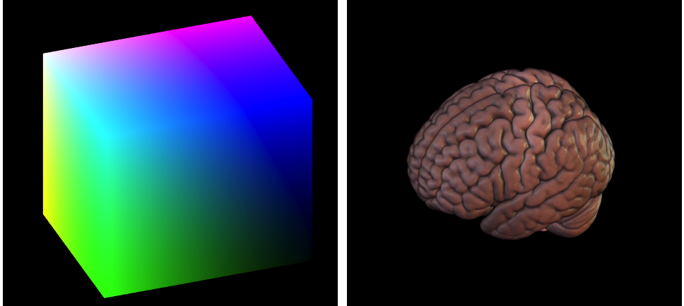
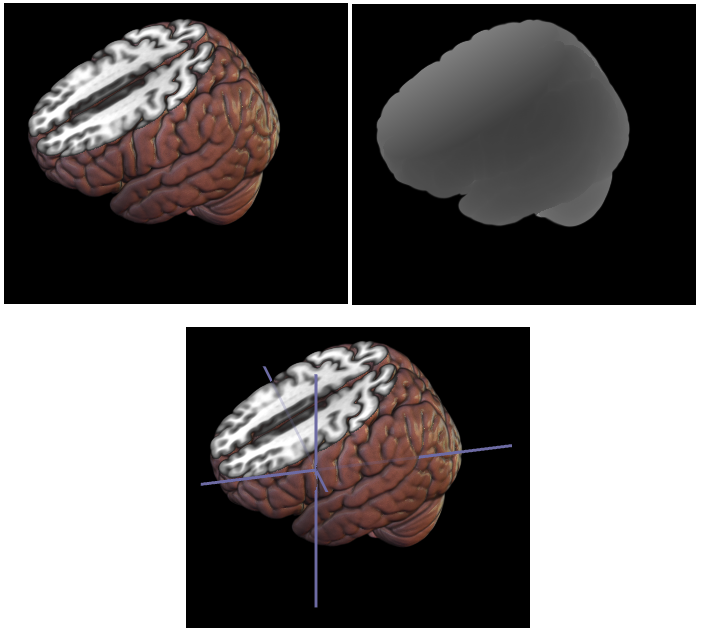

## About

It is often useful to convert the location of a mouse click to object coordinates (e.g. to select the object). We also want objects that are closer to the camera to occlude more distant objects. OpenGL and other accelerated graphics libraries use the `depth buffer` to hide occluded objects and aid [mouse picking](https://www.cs.cornell.edu/courses/cs4620/2017sp/cs4621/lecture08/exhibit03.html). Unfortunately, the default depth buffer does not work for volume ray casting. Here we describe a simple solution.

This description assumes a knowledge of volume ray casting. Good introductions are provided by [Philip Rideout](https://prideout.net/blog/old/blog/index.html@p=64.html) and [Will Usher](https://www.willusher.io/webgl/2019/01/13/volume-rendering-with-webgl). As they note, we have the vertex shader draw a simple cube, with a ray launched for each pixel from the front of the cube to the back. Therefore, the depth recorded by the vertex shader refers to the front of the cube, not the rendered surface. Consider the image below: the left panel shows the front-face of the cube, whereas the right panel shows the rendered object. Note that some rays travel completely through the air, never striking the object, while other rays strike the brain's surface close to the cube's front face. Therefore, we tune our shaders to explicitly set the depth buffer, setting [gl_FragDepth](https://www.khronos.org/registry/OpenGL-Refpages/gl4/html/gl_FragDepth.xhtml) for each pixel.



## Writing the depth buffer

The code below extends [Will Usher's](https://www.willusher.io/webgl/2019/01/13/volume-rendering-with-webgl) description of a ray casting volume renderer. Please see his page for a full description. Our goal here is to simply extend his code to record the depth of the surface in the OpenGL depth buffer `gl_FragDepth`. The ray traverses the volume from front to back, absorbing color from voxels. Here we use `isHit` to detect the first non-transparent voxel.

```
	int isHit = 0; //used to detect first non-transparent voxel
	for (float t = t_hit.x; t < t_hit.y; t += dt) {
		float val = texture(volume, p).r;
		vec4 val_color = vec4(texture(transfer_fcn, vec2(val, 0.5)).rgb, val);
		p += ray_dir * dt;
		if (val_color.a < 0.01) continue; //skip transparent samples
		if (!isHit) { //our first non-transparent voxel
			isHit = 1;
			gl_FragDepth = ((ModelViewProjectionMatrix * vec4(pos, 1.0)).z + 1.0) * 0.5;
		}
		color.rgb += (1.0 - color.a) * val_color.a * val_color.rgb;
		color.a += (1.0 - color.a) * val_color.a;
		if (color.a >= 0.95) {
			break;
		}
	}
```

The effect is shown in the image below. Our shader sets both the fragment color (upper left) and fragment depth (upper right). Once we have set the depth buffer, we can use it to occlude other objects. In the lower panel we subsequently draw three orthogonal lines to show the crosshair. In the image we actually draw these lines twice. First, we draw opaque lines where we enable the [GL_DEPTH_TEST](https://learnopengl.com/Advanced-OpenGL/Depth-testing) with GL_LEQUAL. These lines are occluded when they are behind the rendering surface. Next we draw translucent lines where we disable the depth test, creating faint lines at locations where the line is beneath the rendered surface.



## Reading the depth buffer

Writing to the depth buffer is sufficient to draw occluded items. However, we may also want to determine where the user clicked. For example, we might want the crosshairs to shift move to the location on the volumes surface where the user clicked. 

You can read the depth buffer at canvas pixel X,Y with the following command (make sure to set your glDrawBuffer and glReadBuffer correctly):
```
  glReadPixels( X, Y, 1, 1, GL_DEPTH_COMPONENT, GL_FLOAT, @depth); 
```

Historically, users had access to the [gluUnProject](https://www.khronos.org/registry/OpenGL-Refpages/gl2.1/xhtml/gluUnProject.xml) function. The [NeHe tutorial](http://nehe.gamedev.net/article/using_gluunproject/16013/) describes the usage nicely. This allows us to take the combination of the mouse position and depth buffer and compute the selected location in the object's space. Unfortunately, this function is not available in most modern graphics libraries, but it only takes a few lines of code to reconstruct. The code below provides the transform for [GLSL](https://community.khronos.org/t/converting-gl-fragcoord-to-model-space/57397), though you can find solutions for other tools like [WebGL](https://github.com/bringhurst/webgl-unproject) and [Python](http://pyopengl.sourceforge.net/documentation/manual-3.0/gluUnProject.html),

The input is the mouse horizontal and vertical position (gl_FragCoord.xy) and the depth buffer value at that location (gl_FragCoord.z). It also gets receives the viewport width (view.x), canvas height (view.y) left corner (view.z) and bottom corner (view.w). Note that the variable `gl_ModelViewProjectionMatrixInverse` does not exist in modern OpenGL or webGL, but this is simply the inverse of the matrix used by the vertex shader to warp the vertices to screen space.

```
vec4 v = vec4(2.0*(gl_FragCoord.x-view.x)/view.z-1.0,
              2.0*(gl_FragCoord.y-view.y)/view.w-1.0,
              2.0*texture2DRect(DepthTex,gl_FragCoord.xy).z-1.0,
              1.0 );
v = gl_ModelViewProjectionMatrixInverse * v;
v /= v.w;
``` 

This formula reverses the work of a vertex shader. The vertex shader warps a location from model space to our 2D screen space. Here we warp the screen space to the model's space. This allows us to determine where the user clicked in our volume and update the coordinates accordingly.
