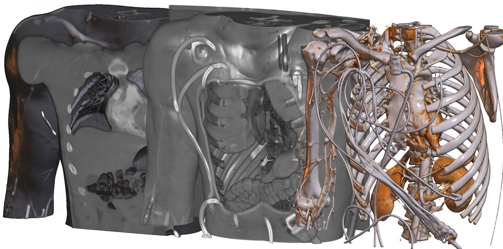
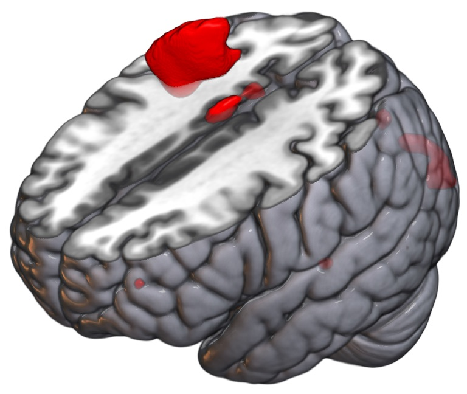
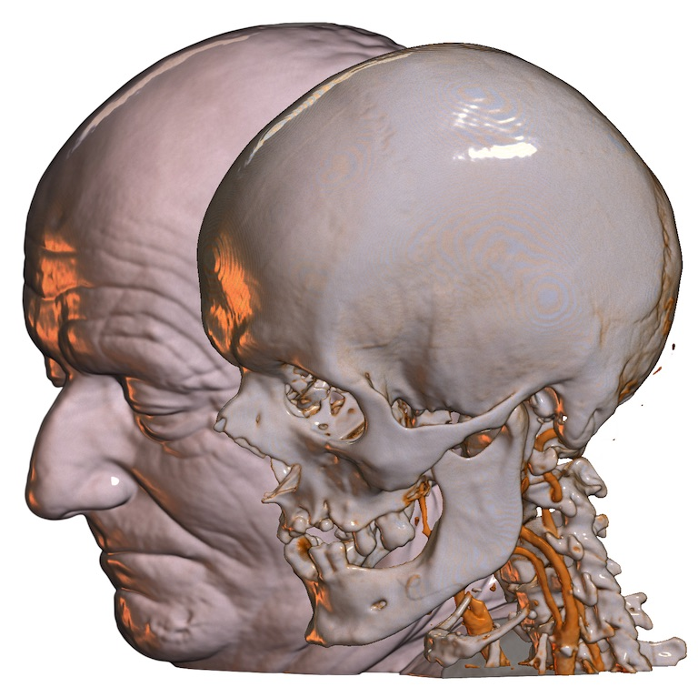
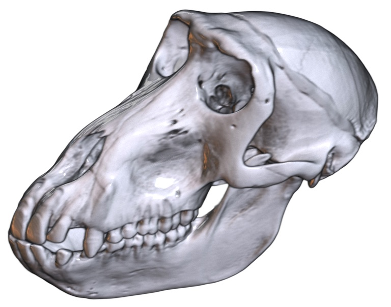

## About

MRIcroGL is a cross-platform tool for viewing DICOM and NIfTI format images. It provides a drag-and-drop user interface as well as a scripting language. Please see the [wiki page](https://www.nitrc.org/plugins/mwiki/index.php/mricrogl:MainPage) from more details. Note that the wiki page describes version 1.0 of the software, while this Github page is for the upcoming version 1.2. The changes are in general subtle, but the [scripting](PYTHON.md) has changed quite a bit.



## Requirements

By default, MRIcroGL 1.2 is compiled to require OpenGL 2.1 (from 2006). It can also be compiled to require OpenGL 3.3 Core (released in 2009). Alternatively, macOS users can also compile the tool for the [Metal](https://developer.apple.com/metal/). From the user perspective, there should be no difference between these choices. If your computer does not support OpenGL 2.1, you can try [MRIcron](https://www.nitrc.org/projects/mricron). The code can be compiled for the macOS, Linux or Windows operating system. For macOS, both ARM-based Apple Silicon and Intel-based computers are natively supported.

## Installation

You can get MRIcroGL using three methods:

 - Download from [NITRC](https://www.nitrc.org/projects/mricrogl/).
 - Download from [Github](https://github.com/neurolabusc/MRIcroGL/releases).
 - Run the following command to get the latest version for Linux, Macintosh or Windows: 
   * `curl -fLO https://github.com/rordenlab/MRIcroGL/releases/latest/download/MRIcroGL_linux.zip`
   * `curl -fLO https://github.com/rordenlab/MRIcroGL/releases/latest/download/MRIcroGL_macOS.dmg`
   * `curl -fLO https://github.com/rordenlab/MRIcroGL/releases/latest/download/MRIcroGL_windows.zip`

  
Once you have downloaded the software, extract the archive and run the executable. Visit the [wiki](https://www.nitrc.org/plugins/mwiki/index.php/mricrogl:MainPage) for a full manual that includes troubleshooting.



## Compiling with the Graphical Interface

It is generally recommended that download a pre-compiled executable (see previous section). However, you can compile your own copy from source code.

 - Download and install [Lazarus 2.0.6 or later](https://www.lazarus-ide.org/).
 - Get the [Metal-Demos repository](https://github.com/neurolabusc/Metal-Demos), for example: `git clone https://github.com/neurolabusc/Metal-Demos`.
 - Get the [MRIcroGL repository]( https://github.com/rordenlab/MRIcroGL.git), for example: `git clone https://github.com/neurolabusc/MRIcroGL`.
 - The Metal-Demos and MRIcroGL folders should share the same parent folder, e.g. `~/src/MRIcroGL` and `~/src/Metal-Demos`.
  - **Option for Windows** You you can decide to build with or without faster gzip decompression:
   - To build **without** faster GZip: Remove the text "{$DEFINE FASTGZ}" from the file opts.inc. Benefit: easier build, uses permissive BSD license.
   - To build **with** faster GZip. Preserve the text "{$DEFINE FASTGZ}" in the file opts.inc. Benefit: faster gzip decompression. However, this only supports CPUs that support SSE4 (2008 and later).
 - **Option** You you can decide to build with or without Python Scripting:
   - To build **without** Python: Open the project MRIcroGL_NoPython.lpi (or remove the text "-dMYPY" from the file MRIcroGL.lpi).
   - To build **with** Python using [python4lazarus](https://github.com/Alexey-T/Python-for-Lazarus) open the project MRIcroGL_Py4Laz.lpi. **[Note, there are issues with the latest python4lazarus](https://github.com/Alexey-T/Python-for-Lazarus/issues/25) release, you should consider compiling without Python support (MRIcroGL_NoPython.lpi) [or use and earlier (2020.07.31)](https://github.com/neurolabusc/Python27-for-Lazarus.git) release (this older release supports both Python 2.7 as well as Python 3.x). Therefore, this build is not recommended. Unlike the recommended PythonBridge, PythonForLazarus attempts to use an existing Python distribution for macOS and Linux. Like PythonBridge, the Windows executable uses a DLL.
   - To build **with** Python using the included [PythonBridge API](https://github.com/genericptr/PythonBridge), open the MRIcroGL.lpi project. This will statically link Python into Unix executables (though you will need to include the Python libraries in your Resources folder). For Windows, this method will use a dynamic link library for Python, and also requires you to include the standard libraries in your Resources folder.
   - To build **with** Python. You will need [python4lazarus_package](https://github.com/Alexey-T/Python-for-Lazarus), but hopefully Lazarus will detect and install this for you automatically. **[Note, there are issues with the latest python4lazarus](https://github.com/Alexey-T/Python-for-Lazarus/issues/25) release, you should consider compiling without Python support (MRIcroGL_NoPython.lpi) [or use and earlier (2020.07.31)](https://github.com/neurolabusc/Python27-for-Lazarus.git) release (this older release supports both Python 2.7 as well as Python 3.x).
 - **Option** macOS developers can build for the modern Metal API instead of the legacy OpenGL API:
   - Get the [lazmetalcontrol repository](https://github.com/genericptr/Metal-Framework).
   - Use the Lazarus Package menu to open and install the lazmetal control.
   - Open and compile the MRIcroGL_Metal.lpi project instead of the MRIcroGL.lpi project with Lazarus (if you do not want Python, remove the text "-dMYPY" from the file MRIcroGL_Metal.lpi).
 - Use the `Run` command from the `Run` menu compile and run your project.

Alternatively, Debian/Ubuntu Linux users may want to look at the [docker script](./DOCKER.md) that provides a line-by-line recipt for compiling MRIcroGL from the command line.

## Compiling with the Command Line

It is generally recommended that download a pre-compiled executable (see previous section). However, you can compile your own copy from source code. Download and install [Lazarus 2.0.6 or later](https://www.lazarus-ide.org/), at which point the lazbuild command should be available from the command line.

 **[Note, there are issues with the latest python4lazarus](https://github.com/Alexey-T/Python-for-Lazarus/issues/25) release, you should consider compiling without Python support (MRIcroGL_NoPython.lpi) [or use and earlier (2020.07.31)](https://github.com/neurolabusc/Python27-for-Lazarus.git) release.


For Linux (GTK2) or Windows (though see notes above), the compilation will look like this :

```
git clone https://github.com/rordenlab/MRIcroGL.git
git clone https://github.com/neurolabusc/Metal-Demos.git
git clone https://github.com/neurolabusc/Python27-for-Lazarus.git
lazbuild --build-ide= --add-package lazopenglcontext ./Python27-for-Lazarus/python4lazarus/python4lazarus_package.lpk
cd MRIcroGL
lazbuild  -B MRIcroGL.lpr
```

For MacOS, you will want to specify the modern Cocoa widgetset, rather than the legacy Cocoa widgetset:

```
git clone https://github.com/rordenlab/MRIcroGL.git
git clone https://github.com/neurolabusc/Metal-Demos.git
git clone https://github.com/neurolabusc/Python27-for-Lazarus.git
lazbuild --build-ide=  --ws=cocoa --add-package lazopenglcontext ./Python27-for-Lazarus/python4lazarus/python4lazarus_package.lpk
cd MRIcroGL
lazbuild  -B --ws=cocoa MRIcroGL.lpi
```

One can also compile for Linux (qt5). Users will need to install [libqt5pas 1.2.8 or later](https://github.com/davidbannon/libqt5pas/releases). This version is more recent than the version provided with Ubuntu 18.04 and Mageia 7.1, so users of many operating systems will have to download the library from Github rather than the conventional install (e.g. `sudo apt install libqt5pas`):
```
git clone https://github.com/rordenlab/MRIcroGL.git
git clone https://github.com/neurolabusc/Metal-Demos.git
git clone https://github.com/neurolabusc/Python27-for-Lazarus.git
lazbuild --build-ide= --add-package lazopenglcontext ./Python27-for-Lazarus/python4lazarus/python4lazarus_package.lpk
cd MRIcroGL
lazbuild  -B --ws=qt5 MRIcroGL.lpi
```

One can also make minor adjustments to these command line options. 
 - `--ws=gtk3` will compile for the GTK3 widgetset. Support for GTK3 is experimental and not all features work (e.g. color selection dialog). GTK3 requires OpenGL 3.3 Core, so you must make sure that the glopts.inc file in the Metal-Demos folder has the line "{$DEFINE COREGL}" uncommented. Unfortunately, GTK3 does not support [OpenGL multi-sampling](https://github.com/aklomp/gtk3-opengl/issues/2) so the results can never match GTK2 or QT5.
 - Compiling `MRIcroGL_NoPython.lpi` will compile without Python scripting support ().



## Deploying MRIcroGL

The MRIcroGL executable has more functionality if it can access its `Resources` folder. This folder includes color lookup tables (`lut` folder), Python scripts (`script`), Material Capture (`matcap`), GLSL Shaders (`shader`), default NIfTI images (`standard`), NIfTI atlases (`atlas`), as well as fonts and icons. Therefore, for full functionality, you want the executable to have access to this folder.
 - For MacOS, the `Resources` folder is placed inside the application package bundle. In other words, if your application is `MRIcroGL.app`, the software expects `MRIcroGL.app/Resources`.
 - For Windows, place the `Resources` folder in the same folder as `MRIcroGL.exe`.
 - For Linux, you can place the `Resources` folder in the same folder as the `MRIcroGL` exectuable. If this fails, it will look for the folder `$MRICROGL_DIR` where `$MRICROGL_DIR` is an environment variable. It will then look a folder in the following order (for the first pass, where the applications actual name is used `MRIcroGL_QT`, and for a second pass using `MRIcroGL`):
 ```
  /opt/MRIcroGL/Resources
  /opt/MRIcroGL
  /opt/MRIcroGL/Resources
  /opt/MRIcroGL
  /usr/local/MRIcroGL/Resources
  /usr/local/MRIcroGL
  /usr/local/MRIcroGL/Resources
  /usr/local/MRIcroGL
  /usr/local/share/MRIcroGL/Resources
  /usr/local/share/MRIcroGL
  /usr/local/share/MRIcroGL/Resources
  /usr/local/share/MRIcroGL
 ```
 
Linux GNOME users may also want to setup a [desktop file](https://developer.gnome.org/integration-guide/stable/desktop-files.html.en) with a name like `MRIcroGL.desktop`. A sample is provided in the Resources folder, but this will require minor editing since the `Exec` and `Icon` path must be [absolute](https://stackoverflow.com/questions/3452746/how-can-i-specify-an-icon-with-a-relative-path-for-a-linux-desktop-entry-file) not relative.

## Scripting and Command Line

You can use all the functions of MRIcroGL using the graphical interface. You can also create [Python scripts](PYTHON.md) to get precise results our automate laborious tasks.

You can also control MRIcroGL from the command line.
 - Launch MRIcroGL and have it automatically run a [Python script](PYTHON.md): `mricrogl myscript.py`. This method also allows you to control MRIcroGL from your preferred programming languages.
 - MacOS uses may find it useful to make an alias to MRIcroGL. This will allow you to simply run `mricrogl` from the command line instead of typing the full path. You can do this by running `open -a TextWrangler ~/.bash_profile` and then [adding an alias](http://osxdaily.com/2007/02/01/how-to-launch-gui-applications-from-the-terminal/), for example adding the line `mricrogl='/Applications/MRIcroGL.app/Contents/MacOS/MRIcroGL'` (assuming the application is in this folder).
 - Reset MRIcroGL to its defaults (forget user preferences): `mricrogl -R`.
 - You can choose the images to load from the command line: `MRIcroGL -std -dr 2000 6000   motor -cm actc -dr 2 4`. In this example, the FSL standard image is loaded as a background with a display range of 2000...6000, and the image 'motor' is loaded as an overlay with the 'actc' colormap and a display range of 2...4. Note that the options are a subset of those available for [fsleyes](https://users.fmrib.ox.ac.uk/~paulmc/fsleyes/userdoc/latest/command_line.html).
   * You can provide an image name: 'motor', 'mni152.nii.gz', etc.
   * If you have FSL installed, you can choose one of the standard images: '-std', '-std1mm', '--standard', '--standard1mm'.
   * You can specify a color map. For example '-cm bone'.
   * You can specify a display range, for example '-dr 3 4'.
   * Note that you can load multiple images, and the color map and display range is applied to the most recently specified image.



## Supported Image Formats

MRIcroGL uses NIfTI as its native format. However, you can drag-and-drop files of various formats and the software should automatically detect and load these images.

 - [AFNI Brik](https://afni.nimh.nih.gov/pub/dist/doc/program_help/README.attributes.html) (.head).
 - [AIM from Scano Medical µCT or HRpQCT](https://www.researchgate.net/publication/320077296_AIMreader_python_implementation_and_examples)(.AIM;1).
 - [Analyze](http://imaging.mrc-cbu.cam.ac.uk/imaging/FormatAnalyze) (.hdr).
 - [Bio-Rad PIC](https://docs.openmicroscopy.org/bio-formats/5.8.2/formats/bio-rad-pic.html) (.pic).
 - [Blender Voxel data](http://pythology.blogspot.com/2014/08/you-can-do-cool-stuff-with-manual.html) (.bvox).
 - [BrainVoyager VMR](https://support.brainvoyager.com/brainvoyager/automation-development/84-file-formats/343-developer-guide-2-6-the-format-of-vmr-files) (.vmr, .v16).
 - [DeltaVision](https://docs.openmicroscopy.org/bio-formats/5.8.2/formats/deltavision.html) (.dv).
 - [DeskVOX and Virvo](http://ivl.calit2.net/wiki/index.php/VOX_and_Virvo) (.rvf, .xvf).
 - [Digital Imaging and Communications in Medicine (DICOM)](https://people.cas.sc.edu/rorden/dicom/index.html)(extension varies)
   - Simple DICOM images can be imported by dragging and dropping.
   - Use the Import menu's  `Convert DICOM to NIfTI` item for advanced conversion.
 - [Drishti PVL Processed VoLume](http://paulbourke.net/dataformats/pvl/) (.pvl.nc).
 - [ECAT](http://nipy.org/nibabel/reference/nibabel.ecat.html) (.v).
 - [FreeSurfer MGH/MGZ Volume](https://surfer.nmr.mgh.harvard.edu/fswiki/FsTutorial/MghFormat) (.mgh/.mgz).
 - [Guys Image Processing Lab](http://rview.colin-studholme.net/rview/rv9manual/fileform.html#GIPL) (.gipl).
 - [ICS Image Cytometry Standard](https://onlinelibrary.wiley.com/doi/epdf/10.1002/cyto.990110502) (.ics).
 - [Interfile](https://www.ncbi.nlm.nih.gov/pubmed/2616095) (.varies, limited support).
 - [ITK MHA/MHD](https://itk.org/Wiki/MetaIO/Documentation) (.mha/.mhd).
 - [MRTrix Volume](https://mrtrix.readthedocs.io/en/latest/getting_started/image_data.html) (.mif/.mih; not all variants supported).
 - [NIfTI](https://brainder.org/2012/09/23/the-nifti-file-format/) (.hdr/.nii/.nii.gz/.voi).
 - [NRRD](http://teem.sourceforge.net/nrrd/format.html) (.nhdr/.nrrd).
 - [POV-Ray Density_File](https://www.povray.org/documentation/view/3.6.1/374/) (.df3).
 - [Portable Network Graphics](https://en.wikipedia.org/wiki/Portable_Network_Graphics) (.png).
 - [Portable PixMap](http://paulbourke.net/dataformats/ppm/) (.pgm, .ppm, .pnm).
 - [slab6 volume format](https://github.com/aframevr/aframe/issues/1891) (.vox)
 - [Spectroscopic Imaging, Visualization and Computing (SIVIC)](https://radiology.ucsf.edu/research/labs/nelson#accordion-software)(.idf).
 - [Stimulate Sdt](https://www.cmrr.umn.edu/stimulate/stimUsersGuide/node57.html) (.spr/.sdt)
 - [Tagged Image File Format](http://paulbourke.net/dataformats/tiff/) (.tiff, .tif, [.lsm](https://www.mathworks.com/matlabcentral/fileexchange/8412-lsm-file-toolbox)).
   - Simple TIFF images can be imported by dragging and dropping.
   - Use the Import menu's  `Convert TIFF to NIfTI` item to convert most TIFFs (this allows you to specify pixel dimensions).
   - Use the Import menu's  `To Convert Folder of 2D TIFFs to NIfTI` to stack a series of TIFF files as a single volume (e.g. [DigiMorph](http://digimorph.org/specimens/Meriones_unguiculatus/)).
 - [Vaa3D](https://github.com/Vaa3D) (.v3draw).
 - [VTK Legacy Voxel Format](https://www.vtk.org/wp-content/uploads/2015/04/file-formats.pdf) (.vtk).
 - [VTK XML Voxel Format](https://vtk.org/Wiki/VTK_XML_Formats) (.vti).
 - [xraw from MagicaVoxel](https://ephtracy.github.io) (.xraw)

If your image format is not supported directly by MRIcroGL, you may want to see if it is supported by the [Bio-Formats module](https://docs.openmicroscopy.org/bio-formats/5.9.2/supported-formats.html) of [ImageJ/Fiji](https://fiji.sc). If so, you can open the image with the module and save it as NIfTI or NRRD to read it with MRIcroGL.

## Rendering Technique

MRIcroGL uses single-pass raycasting to generate volume renderings.

 - [Philip Rideout's seminal description of this method](https://prideout.net/blog/old/blog/index.html@p=64.html)
 - Two-pass rendering explicitly generates a front and back face for a cube that represents the texture coordinates. One pass uses the front face and ray direction to [infer the distance to the back face](https://tavianator.com/fast-branchless-raybounding-box-intersections/)
 - [Martino Pilia provides a nice description of this method](https://martinopilia.com/posts/2018/09/17/volume-raycasting.html)
 - [Will Usher's minimal WebGL2 project](https://github.com/Twinklebear/webgl-volume-raycaster)
 - [MRIcroWeb extends Will Usher's WebGL project to include MatCaps and NIfTI support](https://github.com/rordenlab/MRIcroWeb)
 - [AMI Medical Imaging (AMI) JavaScript ToolKit](https://github.com/FNNDSC/ami) makes volume rendering easy


## Alternatives

There are many terrific free tools for viewing medical imaging data. Since they are free, consider downloading a few and using the best tool for the task at hand. Below are a couple of my personal favorites.

 - [MRIcron](https://www.nitrc.org/projects/mricron) is similar and does not require OpenGL, but it is unable to generate interactive renderings.
 - [DragonFly](https://www.theobjects.com/dragonfly/get-non-commercial-licensing-program.html) is not open source, but it does provide a non-commercial licenses are granted free-of-charge.
 - [Drishti](https://github.com/nci/drishti) has powerful rendering abilities, though support for medical imaging formats is limited.
 - [FSLeyes](https://fsl.fmrib.ox.ac.uk/fsl/fslwiki/FSLeyes) has many similar features, as well as rich support for [FSL](https://fsl.fmrib.ox.ac.uk/fsl/fslwiki/). Variants require either OpenGL 1.4 or OpenGL 2.1.
 - [InVesalius](https://invesalius.github.io) provides useful segmentation tools.
 - [Mango](http://ric.uthscsa.edu/mango/) is a nice viewer.
 - [Slicer 3D](https://www.slicer.org) is daunting at first, but provides tremendous power and flexibility.
 - [Seg3D](https://www.sci.utah.edu/cibc-software/seg3d.html) has powerful segmentation routines.
 - For DICOM images (but not other formats), [Horos](https://horosproject.org) is outstanding.
